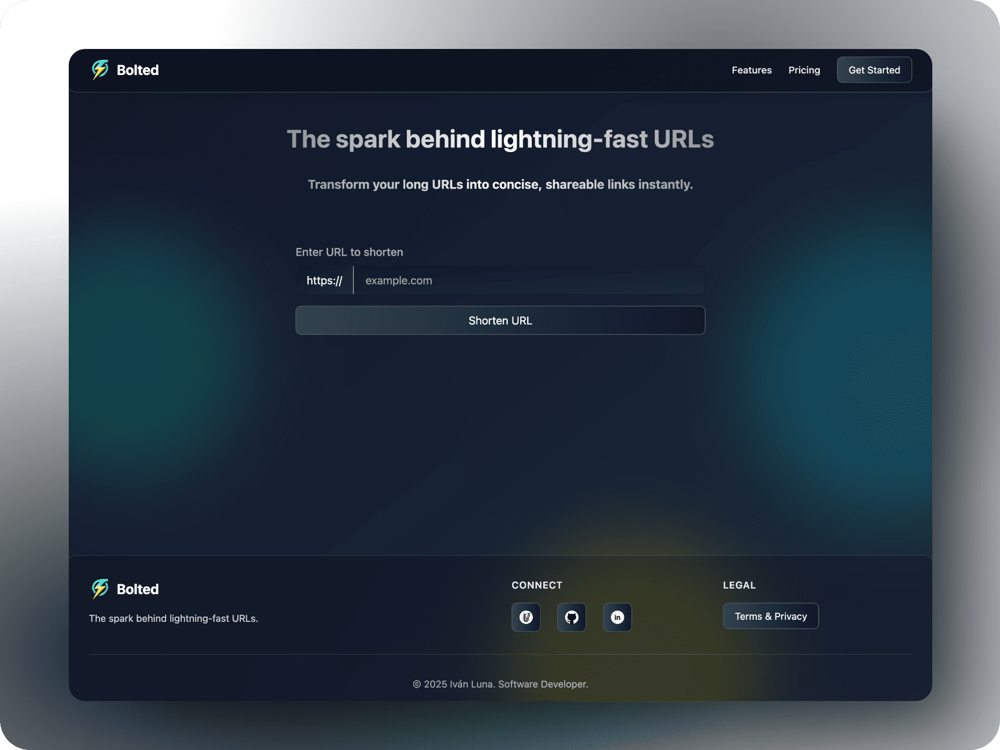

## Bolted - The spark behind lightning-fast URLs.

A lightning-fast URL shortener showcasing the power of modern web technologies. Originally built with Flask, now evolved into a robust FastAPI backend with a sleek Astro.js + React frontend.

<div align="center">
<a href="https://bolted.site" style="display: inline-block; padding: 8px 16px; margin: 0 8px; background: linear-gradient(to right, #00E1A5, #00DAF1); color: white; text-decoration: none; border-radius: 4px;">Live Demo</a>
<a href="https://ivanluna.dev/projects/post-python-bolted/" style="display: inline-block; padding: 8px 16px; margin: 0 8px; background: linear-gradient(to right, #00DAF1, #E1F400); color: white; text-decoration: none; border-radius: 4px;">Project Details</a>
</div>



### Tech Stack

#### Backend (FastAPI)
- High-performance Python web framework
- Async support for better scalability
- Modern API design with automatic OpenAPI documentation
- Type hints and data validation

#### Frontend (Astro.js + React)
- Built with Astro.js for optimal performance
- React components for interactive elements
- Tailwind CSS for modern styling
- Responsive and accessible design

### Key Features

#### Modern URL Shortening
- Quick and efficient URL shortening
- Clean and intuitive user interface
- Copy-to-clipboard functionality
- Automatic HTTPS handling

#### Performance Optimization
- Server-side rendering with Astro.js
- Fast API responses with FastAPI
- Optimized database queries

### Installation

#### Backend Setup
```bash
git clone https://github.com/imprvhub/bolted-python.git
cd bolted-python/backend
pip install -r requirements.txt
cp .env.example .env
```

#### Frontend Setup
```bash
cd ../bolted-frontend
npm install
npm run dev
```

### Environment Variables

#### Backend (.env)
```env
DATABASE_HOST=your_host
DATABASE_USERNAME=your_username
DATABASE_PASSWORD=your_password
DATABASE_NAME=your_database
HASHIDS_SALT=your_salt
CORS_ORIGINS=http://localhost:4321
```

#### Frontend (.env)
```env
PUBLIC_API_URL=http://localhost:8000
```

### Project Evolution

This project evolved from a monolithic Flask application to a modern, decoupled architecture:

Current implementation features:
- Separation of concerns
- Enhanced performance
- Modern development experience
- Improved maintainability

### Contributing

Submit a Pull Request for contributions. For major changes, open an issue first to discuss proposed changes.

### Bug Reports & Feature Requests

Create an [issue](https://github.com/imprvhub/bolted-python/issues/new) with detailed information about bugs or feature requests.

### License

See [User Agreement Section](https://bolted.site) for licensing details.

---